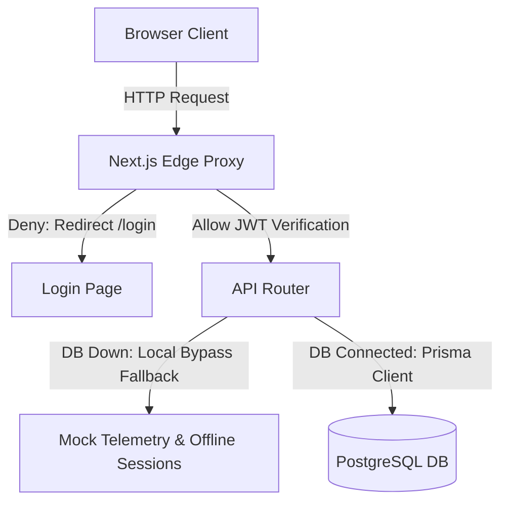

# Odoo Asset Flow

**Odoo Asset Flow** is an enterprise-grade hardware lifecycle coordination and telemetry management deck built specifically for the **Odoo Hackathon** by **Musa Qureshi** and **Muskan Kawadkar**.

---

## 🔐 Authentication Architecture

Authentication is powered by **JWT (JSON Web Tokens)** stored securely inside `assetflow_session` httpOnly cookies. 
All requests are evaluated at the edge using Next.js proxy middleware to verify sessions and route clearance scopes. When the database is offline, a built-in security bypass handles direct validation for the designated admin account.

---

## ⚙️ Services & API Flow

1. **Edge Route Guard:** Requests to `/dashboard/*` are intercepted by the Next.js edge proxy which reads the JWT cookie.
2. **Dynamic APIs:** Authenticated routing routes client operations (Assets, Bookings, Maintenance, Transfers) to Serverless API shards.
3. **Connectivity Fallback:** Services gracefully degrade to mock JSON fallbacks on database connection errors.

---

## 👥 Role Clearances

| Role | clearance level | administrative capability | sidebar visibility |
| :--- | :---: | :--- | :--- |
| **Sys_Admin** | Level 5 | Full system overrides, role mapping, setup | Operations, Profile, Assets, Bookings, Maintenance, Transfers, Audits, Analytics, Setup |
| **Asset_Mgr** | Level 4 | Register/Allocate equipment, schedule audits | Operations, Profile, Assets, Bookings, Maintenance, Transfers, Audits |
| **Dept_Head** | Level 3 | Broadcast notifications, view department reports | Operations, Profile, Bookings, Transfers, Analytics |
| **Employee** | Level 1 | Create bookings, log maintenance requests | Operations, Profile, Bookings, Maintenance, Transfers |

---

## 📊 Database Design Schema

Below is the database structure mapping users, assets, bookings, and operations logs:

---

## 💡 Conclusion
Our modular, highly-scalable architecture decouples data routing from physical databases to ensure enterprise hardware telemetry operations remain fully functional under all conditions.
