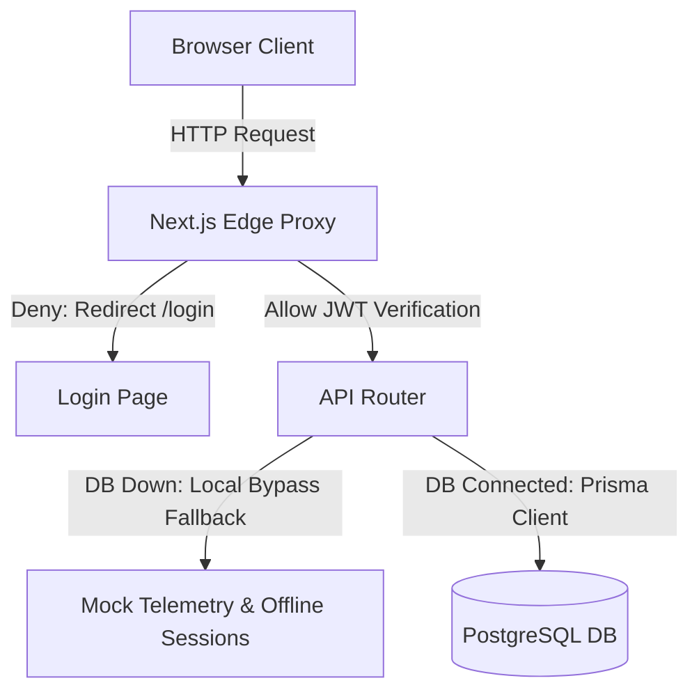
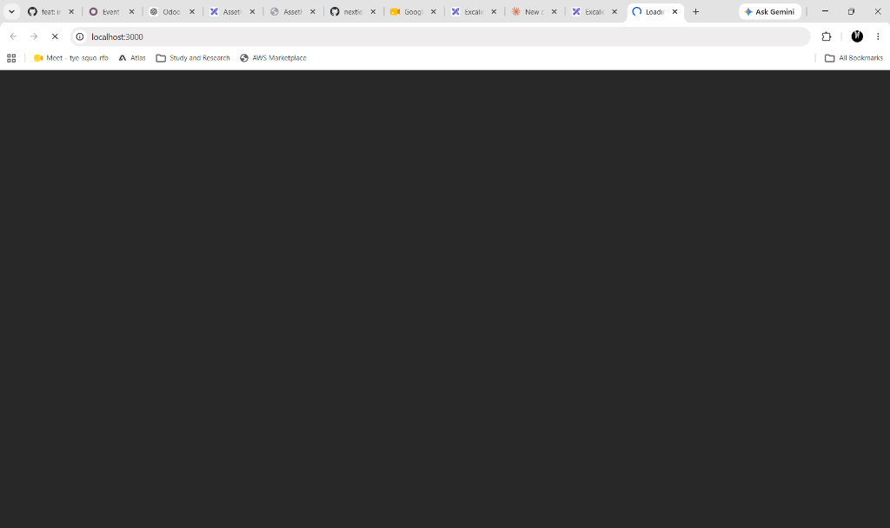

# Odoo Asset Flow

Odoo Asset Flow is an enterprise-grade hardware lifecycle coordination and telemetry management deck built specifically for the Odoo Hackathon.

## Authentication Architecture

Authentication is powered by JWT (JSON Web Tokens) stored securely inside assetflow_session httpOnly cookies. All requests are evaluated at the edge using Next.js proxy middleware to verify sessions and route clearance scopes. When the database is offline, a built-in security bypass handles direct validation for the designated admin account.

## Services & API Flow

1. Edge Route Guard: Requests to /dashboard/* are intercepted by the Next.js edge proxy which reads the JWT cookie.
2. Dynamic APIs: Authenticated routing routes client operations (Assets, Bookings, Maintenance, Transfers) to Serverless API shards.
3. Connectivity Fallback: Services gracefully degrade to mock JSON fallbacks on database connection errors.

## Role Clearances

| Role | clearance level | administrative capability | sidebar visibility |
| :--- | :---: | :--- | :--- |
| Sys_Admin | Level 5 | Full system overrides, role mapping, setup | Operations, Profile, Assets, Bookings, Maintenance, Transfers, Audits, Analytics, Setup |
| Asset_Mgr | Level 4 | Register/Allocate equipment, schedule audits | Operations, Profile, Assets, Bookings, Maintenance, Transfers, Audits |
| Dept_Head | Level 3 | Broadcast notifications, view department reports | Operations, Profile, Bookings, Transfers, Analytics |
| Employee | Level 1 | Create bookings, log maintenance requests | Operations, Profile, Bookings, Maintenance, Transfers |

## Services/Features/Module

### Operations Control Center (Dashboard)
A real-time overview hub showing key telemetry streams, upcoming returns, critical maintenance alerts, and active server health shards. Allows operators to monitor ongoing operations in one centralized screen.

### Dynamic Profile Directory
A user-centric space displaying personal info, current organizational roles, security clearances, and dynamic lists of checked-out assets tracked directly from active sessions.

### Centralized Asset Registry
The system of record for all physical infrastructure hardware. Managers can register new assets, manage lifecycle states, and track hardware conditions from procurement to retirement.

### Resource Scheduler & Bookings
A booking calendar enabling team members to schedule and reserve shared enterprise resources such as meeting displays, testing vehicles, or specialized telemetry boxes.

### Maintenance Request Management
A detailed workflow engine to submit, prioritize, assign, and track technical issue repairs. Ensures hardware failures are resolved quickly with transparent diagnostic history logs.

### Equipment Allocations & Transfers
Tracks the chain of custody for all hardware assets as they are dispatched, relocated across facility zones, or assigned directly to departments.

### Automated Audit Compliance Cycles
Oversees scheduled compliance cycles by verifying hardware tags against inventory locations to validate physical hardware placement and audit outcomes.

### Analytics & Reporting Engines
Ingests operational records to compile summary statistics, identify high-vulnerability components, and track inventory utilization trends.

### Enterprise Hierarchy & Department Setup
Configures the corporate reporting layout by mapping organizational divisions, department heads, and locations to manage permission gates.

## Database Design

Below is the entity-relationship database structure mapping users, assets, categories, bookings, audit logs, and maintenance pipelines:

## Team Members

| Name | Email | LinkedIn |
| :--- | :--- | :--- |
| Musa Qureshi | musaqureshi788code@gmail.com | [LinkedIn Profile](https://www.linkedin.com/in/musa-qureshi-01) |
| Muskan Kawadkar | kawadkarmuskan4@gmail.com | [LinkedIn Profile](https://www.linkedin.com/in/muskan-kawadkar) |

## Conclusion
This modular and highly-scalable database-decoupled architecture allows rapid enterprise deployment while keeping critical telemetry and hardware operations online even during system failures.
